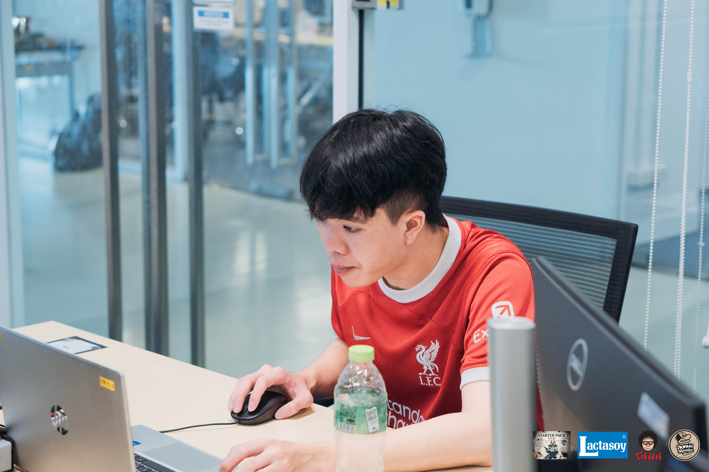
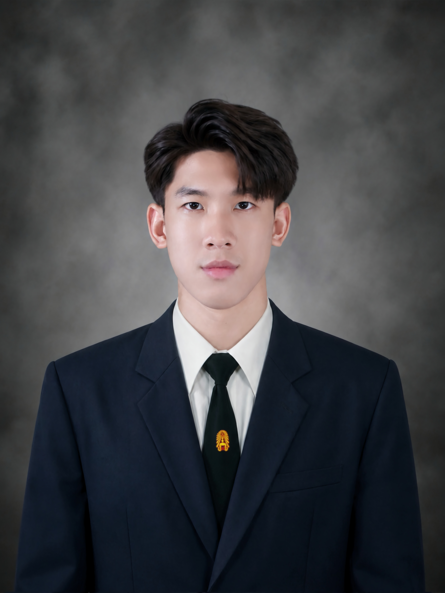
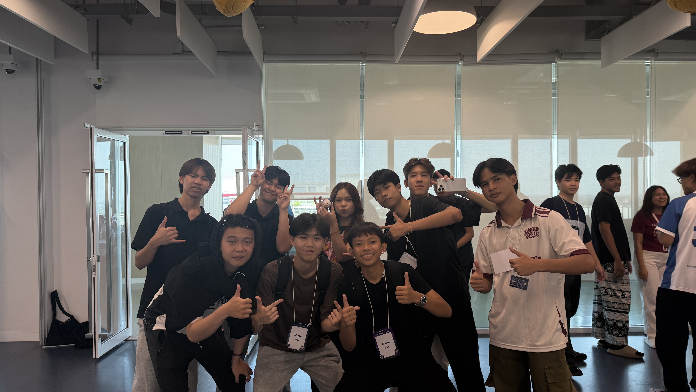
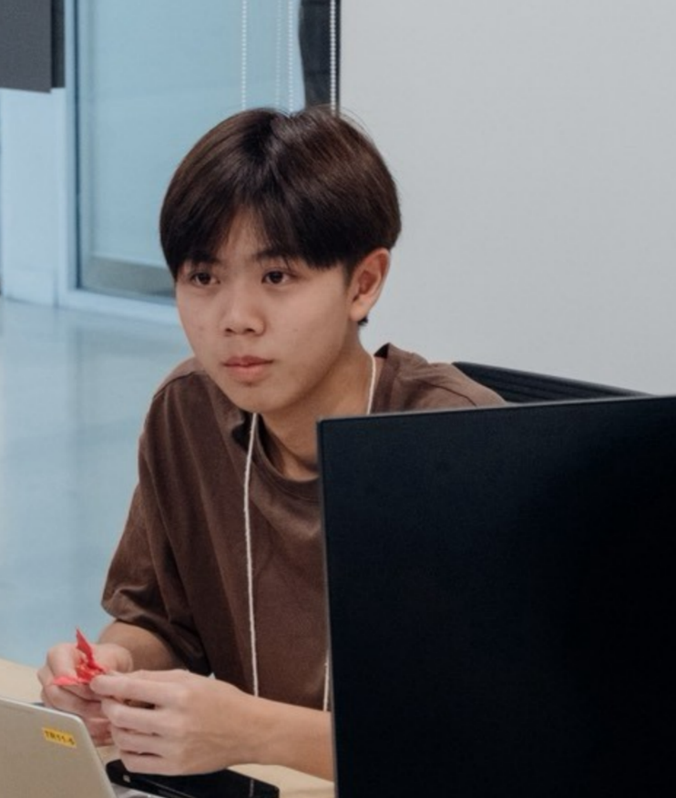
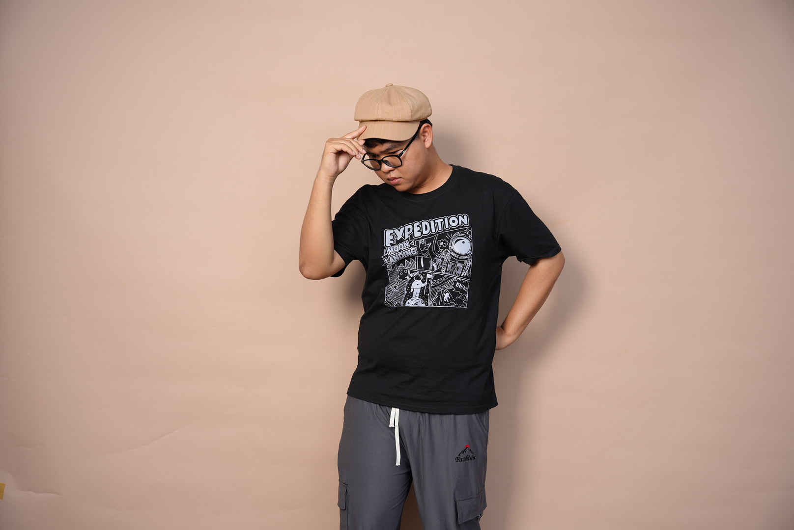
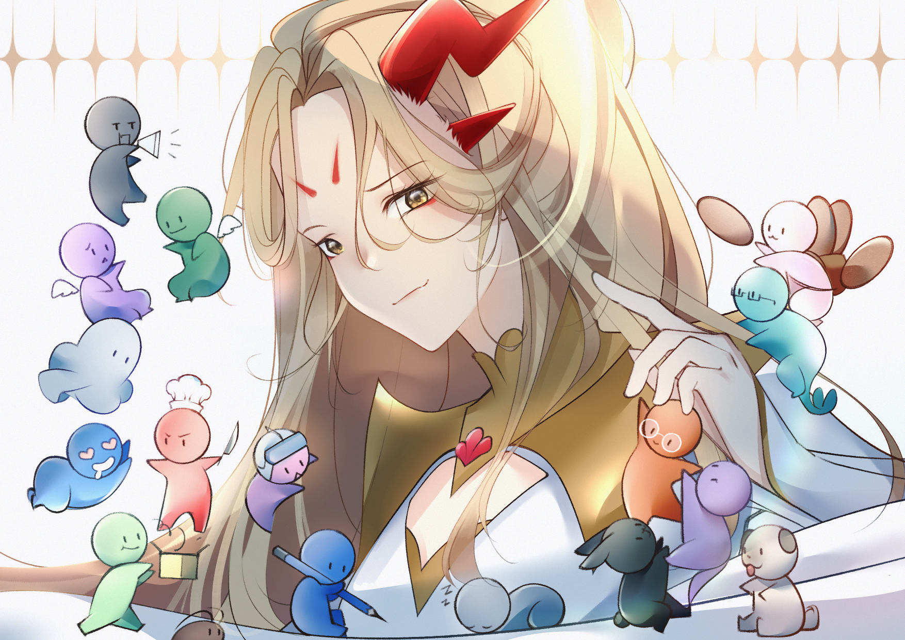
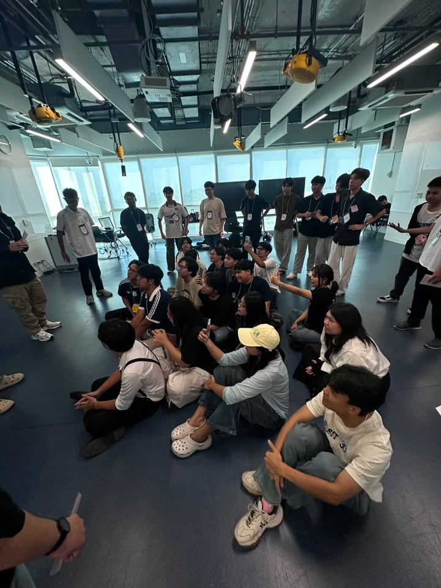

# **Team name : GOAT** :goat:

## **Meaning of the team name** :speech_balloon:
> GOAT หรือ "Greatest Of All Time" แปลว่าดีที่สุดตลอดกาล ชื่อนี้สื่อถึงต้องการให้ทีมของเราเป็นทีมที่ดี ชื่อนี้มาจากการโหวตใน Issues ผ่านการกด Emojiหัวใจที่ commentของชื่อทีมที่เราชอบชื่อทีมไหนได้ Emoji หัวใจเยอะที่สุดจะใช้ชื่อนั้นเป็นชื่อทีม

## **Members** :busts_in_silhouette:
- 1).นาย ณัฐรินทร์ จําเรียงสุขวัฒนา รหัสนักศึกษา : 69130500019
- 2).นาย ศวาวิทย์ หวังวิศวาวิทย์ รหัสนักศึกษา : 69130500060
- 3).นาย เกื้อพสิษฐ์ คงธนชุณหพร รหัสนักศึกษา : 69130500004
- 4).นาย ภาณุพงศ์ สุริยันต์ รหัสนักศึกษา : 69130500045
- 5).นางสาว ธัญภัค ไชยชาดา รหัสนักศึกษา : 69130500025
- 6).นาย ธนพัฒน์ อนันทเพชร รหัสนักศึกษา : 69130500022
---
## **Member 1 : "Peek"**

### Personal information

- Name-surname : Nuttarin Jumriagsukwattana
- Nickname : Peek
- Id : 69130500019
- Birthday: 3 August 2008
- Age : 18
- Favorite food : กะเพราหมูสับ ลาบหมู
- Favorite color : red black
- Travel : Private car
- Contact : [peekksp](https://www.instagram.com/peekksp)
- Github : [nuttarinja-lgtm](https://github.com/nuttarinja-lgtm)

---

# **Goal** :triangular_flag_on_post:
ในด้านอาชีพยังหาคําตอบไม่ได้เพราะว่าตอนนี้อยากจะลองเรียนเพื่อหาสิ่งที่ชอบที่สุดก่อนเพราะไม่อยากเสียดายในภายหลัง ส่วนเป้าหมายในการเรียนที่ SIT KMUTT คือ อยากจะต่อยอดการเรียนรู้ในสายที่สนใจต่อไปรวมถึงอยากจะพบเจอสังคมที่อบอุ่นและพร้อมสําหรับการเรียนรู้

# **Hobby** :eyes:
- เล่นฟุตบอล : ในสมัยเด็กมีโอกาสได้ไปดูฟุตบอลที่สนามแข่งขันจึงเกิดความรู้สึกชอบและทําให้เตะฟุตช่วงหลังเลิกเรียนตลอด

- อ่านนิยายสืบสวน : ช่วงนึงในสมัยเด็กชอบอ่านหนังสือการ์ตูนมากแต่พอโตขึ้นก็มีโอกาสได้ลองซื้อนิยายแนวสืบสวนมาลองอ่าน ทําให้เกิดความรู้สึกชอบและจะคอยพยายามหาเวลาว่างมาอ่านนิยายสืบสวนอยู่เสมอ

# **Why did you choose to study at SIT KMUTT** :question:
ตอนอยู่ ม.ปลาย เลือกลงแผนการเรียน วิทยาศาสตร์ - คอมพิวเตอร์ โรงเรียน นนทบุรีวิทยาลัย ที่นั่นทําให้มีโอกาสได้ลองเรียนทั้งด้าน Hardware และ Software แต่โดยส่วนตัวชอบด้าน Software มากกว่า บวกกับส่วนตัวอยากลองออกมาใช้ชีวิตด้วยตัวเองทําให้ช่วง ม.6 มีโอกาสได้เห็น คณะ เทคโนโลยีสารสนเทศ ของ KMUTT จึงเลือกยื่นเข้ารอบ 1 เพราะว่าตรงกับเงื่อนไขที่เราตั้งไว้

# **Differences from high school** :chart_with_upwards_trend:
การจัดการเวลาเพราะไม่มีคนคอยตามเหมือนปกติแล้วต้องจัดการเวลาของตัวเองให้ดีรวมถึงรูปแบบการเรียนที่แตกต่างจากการเรียนมัธยมทั้งการเช็คชื่อ การส่งงาน หรือการเรียนในห้องเรียน

# **Concerns** :disappointed:
กังวลในด้านภาษาอังกฤษเพราะรูปแบบการสอนที่สไลด์เป็นภาษาอังกฤษ และข้อสอบที่เป็นภาษาอังกฤษ รวมถึงในด้านการปรับตัวทั้งในด้านการเรียนในรูปแบบมหาลัยและการเข้าสังคมใหม่

# **Impressions** :star:
ความประทับใจต่อคนสัมภาษณ์คือ ตองเป็นคนนิสัยดี สัมภาษณ์สบายๆเป็นกันเอง ทําให้ตอนสัมภาษณ์อาการเกร็งลดลง

# **1 photo** :framed_picture:
รูปภาพนี้เป็นรูปตอนค่าย IT Staterpack 32 จากบ้าน Empire cache เป็นกิจกรรมที่ทําให้ได้รู้จักเพื่อน ๆ พี่ ๆ รวมถึงการปูพื้นสําหรับการเรียนที่ SIT KMUTT เหตุผลที่ชอบคือเป็นรูปที่ทําให้เห็นกลุ่มเพื่อนและรุ่นพี่ที่ดีทําให้มีกำลังใจในการเรียนเพราะอยากอยู่กับเพื่อน ๆ พี่ ๆ ต่อไป

### ผู้สัมภาษณ์
> Thanyaphak Chaichada (Tong) 69130500025

---

## **Member 2 : Shokun**

### Personal information

- Name-surname :Swavit Wangvisavavit
- Nickname : shokun
- Id : 69130500060
- Birthday: 6 september 2007
- Age : 18
- Favorite food : salmon
- Favorite color : white
- Travel :drive a car
- Contact : [shxkxn_xyz](https://www.instagram.com/shxkxn_xyz)
- Github :[Shxnkxn](https://github.com/Shxkxn)

---

# **Goal** :triangular_flag_on_post:
อยากเป็นเจ้าของธุรกิจตั้งแต่อายุยังน้อย หาเงินได้เยอะๆอยากไปเที่ยวเก็บประสบการณ์เยอะๆในวัยที่อายุยังน้อย

# **Hobby** :eyes:
ชอบเล่นเปียโน เล่นเกม ขับรถเล่น เพราะสนุก

# **Why did you choose to study at SIT KMUTT** :question:
มีพี่สาวเรียนจบจากที่นี่และประสบความสำเร็จหลายคน เลยอยากที่จะเดินตามรอยพี่สาวในส่วนนี้และคิดว่าความรู้ทางด้านนี้จะจำเป็นที่จะต้องใช้ในอนาคต

# **Differences from high school** :chart_with_upwards_trend:
มหาลัยมีความอิสระหลากหลายมากกว่า ต้องมีความรับผิดชอบในตัวเองมากขึ้นในเรื่องการใช้ชีวิตและการเรียน

# **Concerns** :disappointed:
ไม่ค่อยกังวลอะไรอยากจบเกรดดีๆและใช้ชีวิตมหาลัยให้เต็มที่เก็บประสบการณ์เยอะๆทั้งเรื่องการเรียนการใช้ชีวิต

# **Impressions** :star:
คนที่มาสัมภาษณ์เป็นเพื่อนสนิทใน sec ของผม ผมรู้จักกับบอสเพราะทักไปทำความรู้จักกันตั้งแต่มหาลัยยังไม่เปิด บอสเป็นเพื่อนคนนึงที่ตอบและให้คำแนะนำผมดีๆมากๆตั้งแต่ยังรู้จักกันแรกๆจนถึงตอนนี้

# **1 photo** :framed_picture:

ถ่ายกับเพื่อนๆกลุ่มแรกและยังเป็นกลุ่มปัจจุบัน

## ผู้สัมภาษณ์
> "ใส่ชื่อจริง-นามสกุล : Keuaphasit Kongthanachunhaporn ชื่อเล่น Boss : รหัสนักศึกษา 69130500004"

---

## **Member 3 : "Boss"**

### Personal information

- Name-surname :Keuaphasit Kongthanachunhaporn
- Nickname : Boss
- Id : 69130500004
- Birthday: 6 June 2008
- Age : 18
- Favorite food : Omelet
- Favorite color : Black
- Travel :Drive
- Contact : [instagram](https://www.instagram.com/bossbirbubi)
- Github :[github](https://github.com/keuaphasit08)

---

# **Goal** :triangular_flag_on_post:
เที่ยวรอบโลกกับแฟน เลี้ยงไซบีเรียนกับโกเดลอย่างละตัว มีเงินซื้อบ้านหลังใหญ่ๆอยู่กลางเมืองและชนบท ซื้อรถที่ตัวเองชอบ

# **Hobby** :eyes:
เตะฟุตบอล เพราะชอบดูฟุตบอล ชอบออกกำลังกาย และเล่นมมาตั้งแต่เด็กๆ

# **Why did you choose to study at SIT KMUTT** :question:
มีชื่อเสียงด้านเทคโนโลยี ชอบเนื้อหาทันสมัยอัปเดตทันทุกยุค เพื่อนพ่อแนะนำ

# **Differences from high school** :chart_with_upwards_trend:
มัธยมเรีนยวิชาละ50นาที ต่างกับมหาลัยที่เรียนวิชาละ 3 ชั่วโมงทำให้เบื่อง่าย หลุดโฟกัสง่าย การสอบยากกว่ามัธยมเพราะมหาลัยสอบเป็นภาษาอังกฤษ

# **Concerns** :disappointed:
กังวลว่าจะไม่มีท่ี่ฝึกงาน,เรียนตามคนอื่นไม่ทัน,เรียนไม่รู้เรื่อง,

# **Impressions** :star:
เพื่อนเฟรนลี่ นิสัยดีคุยง่ายถูกคอ ขับรถซิ่ง สาวเยอะ 

# **1 photo** :framed_picture:
ขอ1รูปพร้อมเหตุผลที่ชอบรูปนี้

ถ่ายกับเพื่อนๆพี่ๆใน stater pack เป็นรูปแรกๆขอรั้วมหาลัย

## ผู้สัมภาษณ์
> ใส่ชื่อจริง-นามสกุล :Swavit Wangvisavavit ชื่อเล่น : Shokun รหัสนักศึกษา: 69130500060

---

## **Member 4 : Ton**

### Personal information

- Name-surname :Panupong Suriyan
- Nickname : Ton
- Id : 69130500045
- Birthday: 29/6/2006
- Age : 20
- Favorite food : ramen
- Favorite color : Purple
- Travel :Ride a motorcycle
- Contact : [to_npan.u](https://www.instagram.com/to_npan.u?utm_source=ig_web_button_share_sheet&igsh=ZDNlZDc0MzIxNw==)
- Github :[Nebula [NMV]](https://github.com/Nebula-NMV)

---

# **Goal** :triangular_flag_on_post:
เพราะอยากพยายามทำทุกอย่างให้ได้ เลยอยากเป็น free lance แล้วอยากมีอิสระในการทำงาน ไม่ผูกมัดกับงานงานหนึ่งมากเกินไป

# **Hobby** :eyes:
พูดคุยกับเพื่อนใน discord เพราะเป็นการฝึกพูดกับคนอื่น ซึ่งตอนแรกยังไม่กล้าพูดคุยเท่าไหร่

# **Why did you choose to study at SIT KMUTT** :question:
เพราะเรียน ปวช. มา แล้วอาจารย์แนะนำให้มาเรียนที่นี่ แล้วที่บ้านอยากให้เรียนที่นี่ เลยตัดสินใจมาเรียน

# **Differences from high school** :chart_with_upwards_trend:
ตอนเรียน ปวช. เพื่อนรู้สึกค่อนข้างสบายกว่าที่นี่ เพราะ ปวช. ส่วนใหญ่ไม่มีงานและไม่มีการบ้าน

# **Concerns** :disappointed:
ค่องข้างกังวลเรื่องภาษาอังกฤษ เพราะทุกอย่างที่เรียนเป็นภาษาอังกฤษหมดรวมถึงการสอบและเพื่อนไม่เก่งภาษาอังกฤษ

# **Impressions** :star:
รู้สึกว่าเพื่อนเป็นคนที่ friendly คุยด้วยกันง่าย และมีความเป็นกันเองค่อนข้างมาก

# **1 photo** :framed_picture:
ขอ1รูปพร้อมเหตุผลที่ชอบรูปนี้

เพราะเป็น vtuber ที่เพื่อนชอบและตัวละครเล็กๆ รอบๆ สื่อถึงทุกๆคนที่อยู่ร่วมกันกับ vtuber คนนี้

## ผู้สัมภาษณ์
> Tanaphat Anantaphet (Peak) 69130500022

---

## **Member 5 : Tong**

### Personal information

- Name-surname :Thanyaphak Chaichada
- Nickname : Tong
- Id : 69130500025
- Birthday: 28 January 2008
- Age : 18
- Favorite food : 
- Favorite color : cream
- Travel : Grab , Walk
- Contact : [tc9pk](https://www.instagram.com/tc9pk)
- Github :[tc9pk](https://github.com/tc9pk)

---

# **Goal** :triangular_flag_on_post:
พัฒนา software ต่าง ๆ แล้วก็มีอีกเป้าหมายคือเป็น Music Producer เป็นเป้าหมายแรกที่อยากทำ

# **Hobby** :eyes:
เล่นดนตรี เพราะชอบดนตรีมาก ๆ เวลาใช้เวลากับดนตรีแล้วรู้สึกผ่อนคลาย

# **Why did you choose to study at SIT KMUTT** :question:
เพราะหลักสูตรของสาขานี้ตรงกับสิ่งที่เราสนใจแล้วอยากเรียน

# **Differences from high school** :chart_with_upwards_trend:
รู้สึกว่ามัธยมจะสบายกว่านี้ พอขึ้นมหาลัยแล้วเราต้องโฟกัสกับตัวเองมากขึ้น มีวินัยในตัวเองมากขึ้น

# **Concerns** :disappointed:
กลัวไม่มีเพื่อน กลัวเรียนตามเพื่อนไม่ทัน

# **Impressions** :star:
รู้สึกว่าเป็นคนทำงานเก่ง มีความรับผิดชอบต่องานของตัวเอง

# **1 photo** :framed_picture:
ขอ1รูปพร้อมเหตุผลที่ชอบรูปนี้

"ใส่เหตุผลตรงนี้"

## ผู้สัมภาษณ์
> Nuttarin Jumriagsukwattana : พีค : 69130500019

---

## **Member 6 : พีค**

### Personal information

- Name-surname :Tanaphat Anantaphet
- Nickname : Peak
- Id : 69130500022
- Birthday: 09/10/2007
- Age : 18
- Favorite food : Pad Krapow Moo Krob
- Favorite color : Dark Blue
- Travel : Public Transportation
- Contact : IG [p_peakza12](https://www.instagram.com/p_peakza12/)
- Github : [Peakza12](https://github.com/Peakza12)

---

# **Goal** :triangular_flag_on_post:
มีความตั้งใจที่จะประกอบอาชีพเป็น Data Analyst เนื่องจากในช่วงมัธยม มีความชอบในการรวบรวมข้อมูล แล้วสรุปให้เพื่อน

# **Hobby** :eyes:
1เล่นเกมออนไลน์ แต่เล่นคนเดียว เล่นเกมแนว Moba openworld 

2ฟังเพลง จะชอบแนว Pop-Rockเนื่องจากมีจังหวะและดนตรีที่หนักแน่นมากกว่าแนว Pop ทั่วไป"

# **Why did you choose to study at SIT KMUTT** :question:
เนื่องจากมหาวิทยาลัยเด่นทางด้านเทคโนโลยี ซึ่งตรงกับความสนใจส่วนตัว และอยู่ใกล้บ้าน สะดวกต่อการเดินทาง

# **Differences from high school** :chart_with_upwards_trend:
1 รูปแบบตารางเรียนแตกต่างจากเดิมนื่องจากเคยคุ้นเคยกับการเรียนสายวิทย์-คณิต ที่จัดเวลาเรียนเป็นคาบ คาบละ 50 นาที

2 อิสระเยอะไป ทำให้โฟกัสการเรียนได้ยาก ปล่อยตัวเองมากเกินไป เพราะไม่มีคนคอยตาม

# **Concerns** :disappointed:
1 กลัวเรียนตามคนอื่นไม่ทันเพราะไม่ได้เรียนด้านนี้มา แต่พอมีพื้นฐาน 

2 กังวลเรื่องภาษาอังกฤษเรียนเข้าใจ แต่เขียนไม่ได้"

# **Impressions** :star:
มาสัมภาษณ์ 2 รอบ 

สัมภาษณ์รอบแรก เนื่องจากไม่เคยสัมภาษณ์ทำให้ไม่รู้แนวทาง แต่อาจารย์ ก็เปิดโอกาศให้หาข้อมูลได้

สัมภาษณ์รอบสอง เป็นรอบโครงการเรียนดี บรรยากาศเป็นกันเอง ไม่กดดันเหมือนรอบแรก ไม่มีคำถามเชิงวิชาการ เป็นถามคำถามทั่วไป

# **1 photo** :framed_picture:

เป็นรูปแรกในการเริ่มต้นชีวิตนักศึกษามหาวิทยาลัย
และรูปสุดท้ายตอนมัธยม มีความทรงจำกับเพื่อนๆตอน มัธยมปลาย

## ผู้สัมภาษณ์
> Panupong Suriyan : Ton : 69130500045

---

