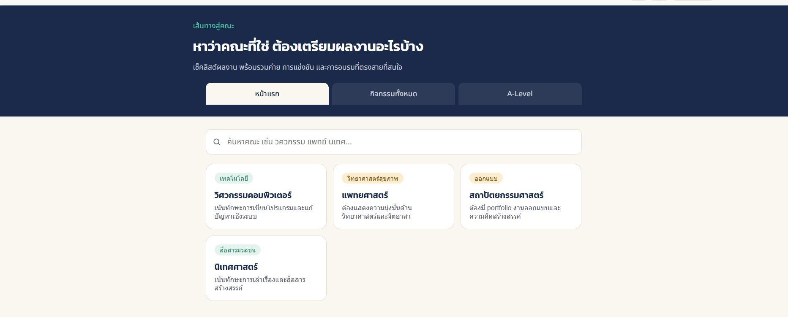
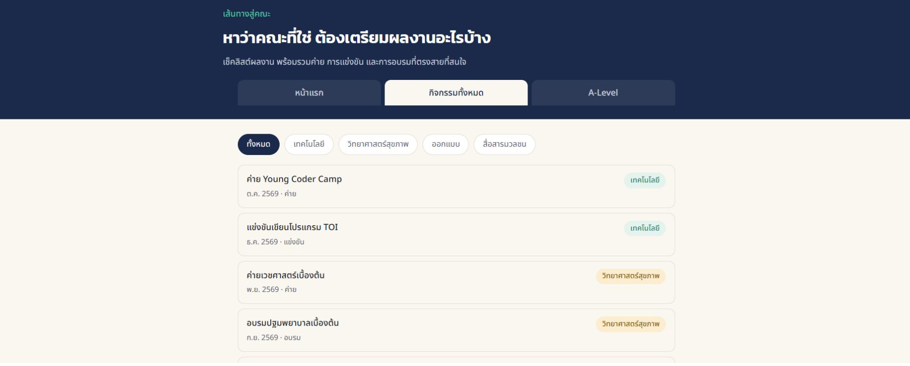
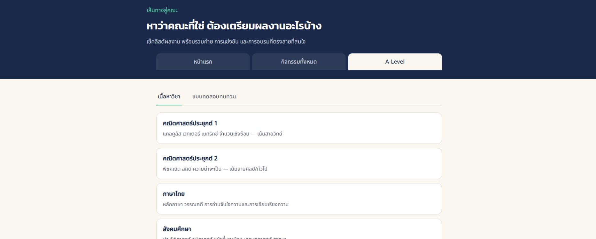

# Emphatize 
# Location :school:
**โรงเรียนบางปะกอกวิทยาคม**

## Pain point :triangular_flag_on_post:
กลุ่มของเราช่วงที่กําลังศึกษาในระดับชั้นมัธยมศึกษาตอนปลายเรามีความกังวลในเรื่องของการเตรียมตัวเข้ามหาวิทยาลัยเพราะต้องการที่จะเข้ามหาลัยที่ตัวเองชื่นชอบแต่ด้วยความกดดันและการแข่งขันที่สูงรวมถึงเรื่องการจัดการแบ่งเวลาในการทําสิ่งต่างๆที่อาจจะมากเกินไป

## Interview questions :page_with_curl:
1. **คำถามพฤติกรรมและแรงจูงใจ:** งานอดิเรกที่น้องชอบใช้เวลากับสิ่งๆ นั้นมากที่สุดคืออะไร และเพราะอะไรถึงชอบทำสิ่งนั้น

2. **คำถามด้านความชอบและความถนัดทางวิชาการ:** วิชาไหนที่น้องคิดว่าชอบที่สุด และคิดว่าเราชอบวิชานั้นเพราะอะไร
3. **คำถามสำรวจอารมณ์และความรู้สึกเชิงลึก:** การที่น้องยังหาความชอบไม่เจอ หรือไม่รู้ว่าจะเข้าคณะไหน น้องมีความรู้สึกอย่างไรกับตัวเองในตอนนี้
4. **คำถามหาเป้าหมายและความสนใจ:** เป้าหมายในอนาคตหลังจบมหาวิทยาลัยของน้องคืออะไร
5. **คำถามค้นหาปัญหาและความกดดัน:** ในกระบวนการเตรียมตัวเข้ามหาวิทยาลัยตอนนี้ น้องรู้สึกหนักใจหรือเครียดกับอะไรที่สุด และเพราะอะไร

## Interview script :speech_balloon:
| ผู้ให้สัมภาษณ์  | งานอดิเรกและแรงจูงใจ | วิชาที่ชอบและความถนัด | ความรู้สึกเรื่องการค้นหาตัวเอง | เป้าหมายในอนาคต | ความกดดันในการเตรียมตัว |
| :--- | :--- | :--- | :--- | :--- | :--- | 
| ชื่อเล่น : โอเว่น  อายุ : 18 มัธยมศึกษาปีที่ 6 | การเล่นกีฬาเพราะต้องการที่จะสุขภาพดี | วิชา คณิตศาสตร์ เพราะเข้าใจง่ายและเรียนมาตั้งนานแล้ว | กังวลเล็กน้อยเพราะยังเลือกมหาวิทยาลัยที่ต้องการไม่ได้แต่เลือกคณะได้แล้วคือ"คณะบริหารธุรกิจ"ทําให้ไม่กังวลมากนัก | เป็นคนรวย | คะแนนสอบเข้ามหาวิทยาลัย |
| ชื่อเล่น : อิงค์  อายุ : 18 มัธยมศึกษาปีที่ 5 | ชอบร้องเพลงฟังเพลงและอ่านหนังสือเป็นบางตรั้ง | วิชา ชีววิทยา เพราะว่าชอบเรียนกับครูผู้สอน | กังวลแค่ในเรื่องการเลือกมหาลัยเพราะตัวเองอยากเรียนรังสีเทคนิคมีตัวเลือก2ที่คือ มจธ และ มช  | ทํางานในสายที่ตัวเองชอบ | กังวลเรื่องการอ่านหนังสือกลัวอ่านไม่ทัน |
| ชื่อเล่น : ไอย์ด้า อายุ : 18 มัธยมศึกษาปีที่ 6| ดูหนัง เพราะชอบดูหนังกับครอบครัว| วิชา ภาษาอังกฤษ เพราะมั้นใจในภาษาอังกฤษที่สุด| ไม่กังวลเลยเพราะเลือกได้แล้วอยากเข้า BMCI ธรรมศาสตร์ | ทำงานที่มีความมั่นคงทางรายได้ | การอ่านหนังสือเพราะยังไม่ได้เริ่มอ่านเลย |
| ชื่อเล่น : เฟียส อายุ : 18 มัธยมศึกษาปีที่ 6| ฟังเพลง เพราะชอบไปคอนเสิร์ตเป็นสายฟังเพลงอยู่แล้ว| วิชา ภาษาอังกฤษ เพราะ เป็นวิชาที่เรียนได้ดีที่สุด| คณะวรศาสตร์ มหาวิทยาลัยธรรมศาสตร์ | ทำเบื้องหลังไม่ก็ธุรกิจส่วนตัว | กังวลเรื่อง Portfolioเพราะยังไม่ได้เริ่มทำPortfolioเลย |
| ชื่อเล่น : ไหม อายุ : 18 มัธยมศึกษาปีที่ 5 | ฟังเพลง เพราะไม่ต้องคิดอะไรเยอะชิลๆดี| วิชา ภาษาอังกฤษ เพราะไม่ได้ยากสําหรับตัวเองขนาดนั้น| อยากเข้าสังคมศาสตร์และมนุษย์ศาสตร์มหิดลเลยไม่ค่อยกังวลเรื่องนี้เท่าไหร่ | ทำงานที่มีรายได้มั่นคง | การทำ Portfolioและการเตรียมตัวเก็บเนื้อหา A level |
| ชื่่อเล่น : ใบข้าว อายุ : 18 มัธยมศึกษาปี่ที่ 6| เล่นโซเชียลมีเดียเพราะเพลินดี | วิชา คณิตศาสตร์ เพราะว่าเข้าใจง่าย | ไม่กังวลเพราะตอนนี้อยากเข้า จิตวิทยาของ จุฬา | ทํางานที่ตรงสายและชอบ | คะแนนสอบวิชาที่ต้องใช้เข้าคณะที่ชอบ |
| ชื่อเล่น : เฟิร์ส อายุ : 18 มัธยมศึกษาปีที่ 6 | ดุซีรีส์ เพราะชอบนักแสดง| วิชา ภาษาจีน เพราะชอบภาษาจีนอยู่แล้วทําให้เวลาเรียนแล้วสนุก| BMICI มหาวิทยาลัย ธรรมศาสตร์ | ทำงานที่มีความมั่นคงและสบาย | Portfolio และคะแนนสอบเข้ามหาวิทยาลัย |

## What How Why :question:
- **What :** นักเรียนมัธยมศึกษาตอนปลายกังวลเรื่องการเตรียมตัวสอบเข้ามหาวิทยาลัย
หรือการเตรียมตัวเข้ารอบPortfolioเพื่อเข้ามหาวิทยาลัยที่ตัวเองอยากจะเข้า

- **How :** เพราะเรื่องความกดดันจากความคาดหวังหรือเรื่องของเวลาที่กระชั้นชิดเข้ามาเรื่อยๆทําให้นักเรียนมัธยมศึกษาตอนปลายเกิดความกังวลสับสนและกดดัน
- **Why :** น้องๆมัธยมศึกษาตอนปลายสับสนว่าจะทําอย่างไหนก่อนหลังจะเริ่มตอนนี้ทันไหมเริ่มช้าไปรึป่าวPORTFOLIOที่มีตอนนี้จะตรงกับที่เกณฑ์มหาลัยต้องการรึเปล่า

## Say do think feel :busts_in_silhouette:
- **Say :**  กังวลเรื่องการเตรียมตัวสอบไม่ทัน
 การทำ Portfolio ที่ยังไม่มีผลงาน
คะแนนสอบ (A-Level)ที่อาจไม่ถึงเป้าหมาย

- **Do :** • ใช้เวลาว่างไปกับสื่อบันเทิงและการพักผ่อนเพื่อลดความตึงเครียดจากการเรียน• แสดงออกอย่างเป็นกันเอง ยิ้มแย้ม และหัวเราะ
- **Think :**  ส่วนใหญ่มองว่าความสำเร็จในอนาคตวัดจากความมั่นคงทางการเงินและผลตอบแทนที่คุ้มค่า
 ทุกคนรู้สึกว่าช่วงมัธยมศึกษาตอนปลายนี้ เป็นช่วงเวลาที่ต้องเร่งเตรียมตัวสอบเข้ามหาวิทยาลัย

- **Feel :**  รู้สึกสนุกสนานและผ่อนคลายเมื่อพูดถึงไลฟ์สไตล์ งานอดิเรก หรือเรื่องความฝัน
รู้สึกกดดัน กังวล เกี่ยวกับเรื่องเวลา การทำ Portfolio และผลการสอบเข้ามหาวิทยาลัย

## User persona & Journey map :bust_in_silhouette: :chart_with_upwards_trend:
.jpg)
.jpg)

---
.jpg)
.jpg)

## 
ผู้รับผิดชอบ 

### นายณัฐรินทร์ จําเรียงสุขวัฒนา    นายภาณุพงศ์ สุริยันต์

---
  

# Define 
# Need - Insight 💡

## ประเด็นที่ 1: การเตรียมผลงาน (Portfolio) 📚

### Need :

ต้องการ แนวทางและเกณฑ์ที่ชัดเจน ในการเตรียมผลงาน Portfolio ที่ตรงกับความต้องการของคณะ/มหาวิทยาลัยในฝัน

### Insight :

เพราะ ความกังวลว่าสิ่งที่ทำไปจะไม่ตรงเกณฑ์ ทำให้เกิดภาวะไม่กล้าเริ่มต้นจนปล่อยเวลาล่วงเลยไปโดยยังไม่ได้เริ่มทำผลงาน

---
## ประเด็นที่ 2: การจัดสรรเวลาและการเตรียมตัวสอบ (A-Level)📝

### Need:
ต้องการ การวางแผนตารางเวลาและการทบทวนเนื้อหาที่มีประสิทธิภาพ เพื่อให้เตรียมตัวสอบได้ทันตามเป้าหมายโดยไม่กระทบเวลาพักผ่อน

### Insight:

เพราะ แม้จะรู้ว่าต้องเร่งอ่านหนังสือ แต่สภาวะความเครียดและเวลาที่กระชั้นชิดกลับกดดันให้ต้องหลบไปพักผ่อน นำไปสู่ความรู้สึกผิดและสับสนว่าควรเริ่มจัดการสิ่งใดก่อนหลัง

---

## ประเด็นที่ 3: อนาคตและความมั่นใจ 🎯

### Need:

ต้องการ ความแน่นอนและความมั่นใจว่าเส้นทางที่กำลังเตรียมตัวอยู่นั้น จะนำไปสู่การติดคณะในฝันได้อย่างจริงแท้

### Insight:

เพราะ การสอบเข้ามหาวิทยาลัยถูกมองว่าเป็นเดิมพันเดียวสู่อนาคตที่มั่นคง ความกลัวล้มเหลวในสภาวะที่มีโอกาสจำกัด จึงกลายเป็นความกดดันมหาศาลที่บั่นทอนความมั่นใจในตนเอง 

---

# POV(Point of view)  :thinking:

[นักเรียนชั้นมัธยมศึกษาตอนปลายที่สนใจศึกษาต่อในระดับมหาวิทยาลัย] *ต้องการ*    [ความมั่นใจและการวางแผนที่แม่นยำว่าคะแนนและ Portfolio จะพาไปถึงมหาวิทยาลัยที่ฝันไว้ได้จริง] *เพราะ* [พวกเขากลัวความผิดหวังและขาดความมั่นใจในตัวเอง ท่ามกลางบรรยากาศการแข่งขันที่สูงลิ่วและเวลาที่มีจำกัด]

# HOW MIGHT WE :thought_balloon:

>- เราจะช่วยให้นักเรียนม.ปลาย จัดสรรเวลาอ่านหนังสือสอบ ทำ Portfolio และมีเวลาพักผ่อน พร้อมกันได้อย่างไร ?
>- เราจะช่วยให้นักเรียนที่ไม่รู้จะเริ่มอย่างไร สามารถเตรียมผลงาน Portfolio ได้ตรงตามเกณฑ์ของมหาวิทยาลัยได้ง่ายและมั่นใจขึ้นได้อย่างไร ?
>-  เราจะช่วยให้นักเรียนรู้สึกผ่อนคลาย มั่นใจ และวางแผนทำคะแนนสอบเข้าคณะในฝันได้อย่างไร ?
## 
ผู้รับผิดชอบ 

### นายธนพัฒน์ อนันทเพชร 
---
  
# Ideate

# Final elected idea(s) : :bulb:
เว็บรวบรวมข้อมูลเกี่ยวกับผลงานแต่ะคณะ การอบรม การแข่งขันของแต่ละสาย มีสรุปเนื้อหา A-LEVEL แล้ว gen คำถามสั้น ๆ เพื่อทบทวนเนื้อหา มีห้องแชทให้พูดคุย แลกเปลี่ยนข้อมูลหรือให้คำแนะนำกันได้
## 
ผู้รับผิดชอบ 

### นายศวาวิทย์ หวังวิศวาวิทย์
---
  
# Prototype
# First page

- **วัตถุประสงค์:** หน้าแรกเป็นจุดเริ่มต้นสำหรับผู้ใช้งาน เพื่อเลือกคณะหรือสาขาวิชาที่สนใจ
- **ฟีเจอร์หลัก:** แสดงรายการคณะต่าง ๆ (เช่น สายสุขภาพ, สายเทคโนโลยี, สายออกแบบ)พร้อมระบบค้นหาและตัวกรองเพื่อความสะดวกในการเข้าถึงข้อมูลเชิงลึกของแต่ละคณะ

# Second page

- **วัตถุประสงค์:** หน้าที่สองเป็นศูนย์รวมกิจกรรมทั้งหมด
- **ฟีเจอร์หลัก:** จัดหมวดหมู่กิจกรรมไว้อย่างเป็นระเบียบ เช่น กิจกรรมเสริมทักษะ กิจกรรมกลุ่มสัมพันธ์ และเวิร์กช็อป เพื่อให้ผู้ใช้เลือกเข้าร่วมได้ตามความสนใจ

# Third page

- **วัตถุประสงค์:** หน้าที่สามเป็นคลังข้อมูลสำหรับการเตรียมตัวสอบ
- **ฟีเจอร์หลัก:** รวบรวมข้อสอบ A-Level ครบทุกวิชาจัดเรียงย้อนหลังตั้งแต่ปีแรกที่มีการจัดสอบ พร้อมระบบตรวจคำตอบและสถิติคะแนนเพื่อประเมินความพร้อม
## 
ผู้รับผิดชอบ 

### นายเกื้อพสิษฐ์ คงธนชุณหพร 
---
  
# Test 
# คำถามสำหรับการทดสอบระบบ :question:
- คุณคิดว่าหน้าเว็บและเมนูต่าง ๆ เข้าใจง่ายและใช้งานสะดวกหรือไม่? เพราะอะไร

- ฟังก์ชันค้นหาคณะและข้อมูลเช็กลิสต์ผลงานที่ควรเตรียม ช่วยให้คุณวางแผนการเตรียมตัวเข้าคณะได้มากน้อยแค่ไหน?
- การแสดงข้อมูลค่าย การแข่งขัน และการอบรม สามารถช่วยให้คุณหากิจกรรมที่ตรงกับสายคณะที่สนใจได้หรือไม่ และมีข้อมูลส่วนใดที่คิดว่าควรเพิ่ม?
- ส่วน A-Level และแบบทดสอบทบทวนใช้งานง่ายและช่วยให้คุณประเมินความรู้ของตัวเองได้หรือไม่? มีอะไรที่ควรปรับปรุงบ้าง?
- ถ้าคุณสามารถเพิ่มหรือเปลี่ยนแปลงฟังก์ชันของเว็บได้ 1 อย่าง คุณอยากให้เว็บเพิ่มหรือปรับปรุงอะไร เพราะอะไร?

# การสัมภาษณ์ผู้ใช้ 👥
## 1. พีท
1. คุณคิดว่าหน้าเว็บและเมนูต่าง ๆ เข้าใจง่ายและใช้งานสะดวกหรือไม่? เพราะอะไร?
- เข้าใจง่ายและเมนูแบ่งเป็นหมวดหมู่ค่อนข้างชัดเจน ทำให้สามารถหาข้อมูลที่ต้องการได้สะดวก แต่บางหน้ามีข้อมูลเยอะเกินไป อาจทำให้ต้องใช้เวลาอ่าน

2. ฟังก์ชันค้นหาคณะและข้อมูลเช็กลิสต์ผลงานที่ควรเตรียม ช่วยให้คุณวางแผนการเตรียมตัวเข้าคณะได้มากน้อยแค่ไหน?
- ช่วยได้มาก เพราะทำให้รู้ว่าคณะที่สนใจต้องเตรียมผลงานหรือทักษะอะไรบ้าง และสามารถวางแผนเตรียมตัวตั้งแต่ ม.4 ได้

3. การแสดงข้อมูลค่าย การแข่งขัน และการอบรม สามารถช่วยให้คุณหากิจกรรมที่ตรงกับสายคณะที่สนใจได้หรือไม่ และมีข้อมูลส่วนใดที่คิดว่าควรเพิ่ม?
- ช่วยได้ เพราะทำให้เจอกิจกรรมที่เกี่ยวข้องกับคณะที่สนใจได้ง่ายขึ้น อยากให้เพิ่มวันรับสมัคร สถานที่ ค่าใช้จ่าย และลิงก์สมัคร

4. ส่วน A-Level และแบบทดสอบทบทวนใช้งานง่ายและช่วยให้คุณประเมินความรู้ของตัวเองได้หรือไม่? มีอะไรที่ควรปรับปรุงบ้าง?
- ใช้งานง่ายและช่วยประเมินความรู้ได้ดี อยากให้มีเฉลยพร้อมคำอธิบายหลังทำแบบทดสอบ เพื่อให้รู้ว่าทำไมถึงผิด

5. ถ้าคุณสามารถเพิ่มหรือเปลี่ยนแปลงฟังก์ชันของเว็บได้ 1 อย่าง คุณอยากให้เว็บเพิ่มหรือปรับปรุงอะไร เพราะอะไร?
- อยากให้เพิ่มระบบบันทึกคณะที่สนใจและกิจกรรมที่อยากเข้าร่วม เพราะจะได้กลับมาดูข้อมูลได้ง่ายโดยไม่ต้องค้นหาใหม่

## 2. มายด์
1. คุณคิดว่าหน้าเว็บและเมนูต่าง ๆ เข้าใจง่ายและใช้งานสะดวกหรือไม่? เพราะอะไร
- โดยรวมเข้าใจง่าย แต่บางเมนูยังไม่ค่อยชัดเจนว่าภายในมีข้อมูลอะไร ถ้ามีคำอธิบายสั้น ๆ เพิ่มเติมจะช่วยให้ใช้งานง่ายขึ้น

2. ฟังก์ชันค้นหาคณะและข้อมูลเช็กลิสต์ผลงานที่ควรเตรียม ช่วยให้คุณวางแผนการเตรียมตัวเข้าคณะได้มากน้อยแค่ไหน?
- ช่วยได้ค่อนข้างมาก เพราะสามารถดูข้อมูลคณะที่สนใจและตรวจสอบว่าตัวเองมีผลงานอะไรแล้วหรือยังขาดอะไร ทำให้วางแผนทำ Portfolio ได้ดีขึ้น

3. การแสดงข้อมูลค่าย การแข่งขัน และการอบรม สามารถช่วยให้คุณหากิจกรรมที่ตรงกับสายคณะที่สนใจได้หรือไม่ และมีข้อมูลส่วนใดที่คิดว่าควรเพิ่ม?
- ช่วยได้ แต่ถ้ามีกิจกรรมจำนวนมากอาจค้นหายาก อยากให้เพิ่มระบบกรองตามคณะ สาขา จังหวัด และประเภทกิจกรรม

4. ส่วน A-Level และแบบทดสอบทบทวนใช้งานง่ายและช่วยให้คุณประเมินความรู้ของตัวเองได้หรือไม่? มีอะไรที่ควรปรับปรุงบ้าง?
- ใช้งานง่ายและช่วยให้รู้ว่าตัวเองมีความรู้ระดับไหน ควรเพิ่มสรุปคะแนนและบอกหัวข้อที่ควรกลับไปทบทวนเพิ่มเติม

5. ถ้าคุณสามารถเพิ่มหรือเปลี่ยนแปลงฟังก์ชันของเว็บได้ 1 อย่าง คุณอยากให้เว็บเพิ่มหรือปรับปรุงอะไร เพราะอะไร?
- อยากให้เพิ่มระบบแจ้งเตือนวันรับสมัครค่ายและการแข่งขัน เพราะบางครั้งอาจลืมหรือพลาดวันสมัคร

## 3. ฟ้า
1. คุณคิดว่าหน้าเว็บและเมนูต่าง ๆ เข้าใจง่ายและใช้งานสะดวกหรือไม่? เพราะอะไร
- ค่อนข้างเข้าใจง่าย เพราะแบ่งข้อมูลเป็นส่วนต่าง ๆ ชัดเจน แต่บางหน้ามีข้อความเยอะ ถ้าปรับให้กระชับและเน้นข้อมูลสำคัญมากขึ้นจะใช้งานสะดวกกว่าเดิม

2. ฟังก์ชันค้นหาคณะและข้อมูลเช็กลิสต์ผลงานที่ควรเตรียม ช่วยให้คุณวางแผนการเตรียมตัวเข้าคณะได้มากน้อยแค่ไหน?
- ช่วยได้มาก โดยเฉพาะช่วงเตรียมเข้ามหาวิทยาลัย เพราะสามารถตรวจสอบได้ว่าคณะที่ต้องการมีเกณฑ์หรือผลงานอะไรที่ควรเตรียม และช่วยให้รู้ว่าตัวเองยังขาดอะไร

3. การแสดงข้อมูลค่าย การแข่งขัน และการอบรม สามารถช่วยให้คุณหากิจกรรมที่ตรงกับสายคณะที่สนใจได้หรือไม่ และมีข้อมูลส่วนใดที่คิดว่าควรเพิ่ม?
- ช่วยได้ เพราะรวมกิจกรรมหลายประเภทไว้ในที่เดียว อยากให้เพิ่มข้อมูลว่ากิจกรรมนั้นเกี่ยวข้องกับคณะหรือสาขาใด และสามารถนำไปใส่ Portfolio ได้หรือไม่

4. ส่วน A-Level และแบบทดสอบทบทวนใช้งานง่ายและช่วยให้คุณประเมินความรู้ของตัวเองได้หรือไม่? มีอะไรที่ควรปรับปรุงบ้าง?
- ใช้งานง่ายและเหมาะสำหรับเช็กความรู้เบื้องต้น อยากให้เพิ่มระดับความยากของข้อสอบและแสดงสถิติคะแนน เพื่อดูว่าคะแนนของตัวเองพัฒนาขึ้นหรือไม่

5. ถ้าคุณสามารถเพิ่มหรือเปลี่ยนแปลงฟังก์ชันของเว็บได้ 1 อย่าง คุณอยากให้เว็บเพิ่มหรือปรับปรุงอะไร เพราะอะไร?
- อยากให้เพิ่มระบบจัดเก็บและจัดหมวดหมู่ผลงานสำหรับ Portfolio เพราะ ม.6 ต้องรวบรวมผลงานหลายอย่าง หากมีระบบช่วยจัดเก็บจะทำให้เตรียม Portfolio ได้สะดวกขึ้น

# feedback Matrix 📱
Like it     👍🏻                                                           |Change it 👎🏻                                   |
| ---------------------------------------------------------------------------------- | ----------------------------------------------------------------------- |
| • หน้าเว็บและเมนูโดยรวมเข้าใจง่าย แบ่งข้อมูลเป็นหมวดหมู่ชัดเจน                     | • บางหน้ามีข้อมูลและข้อความมากเกินไป ควรปรับให้กระชับและเน้นข้อมูลสำคัญ |
| • ระบบค้นหาคณะและ Checklist ช่วยวางแผนการเตรียม Portfolio ได้ดี                    | • บางเมนูยังไม่ชัดเจนว่าภายในมีข้อมูลอะไร ควรเพิ่มคำอธิบายสั้น ๆ        |
| • ข้อมูลค่าย การแข่งขัน และการอบรมช่วยให้ค้นหากิจกรรมที่เกี่ยวข้องกับคณะที่สนใจได้ | • ควรเพิ่มระบบกรองกิจกรรมตามคณะ สาขา จังหวัด และประเภทกิจกรรม           |
| • ส่วน A-Level และแบบทดสอบใช้งานง่าย ช่วยประเมินความรู้ของตนเองได้                 | • แบบทดสอบควรมีเฉลยพร้อมคำอธิบาย และแสดงสถิติ/คะแนนพัฒนาการ             |
|                                                                                    | • ควรเพิ่มข้อมูลวันรับสมัคร สถานที่ ค่าใช้จ่าย และลิงก์สมัครกิจกรรม     |

|Questions raised ❓                    | Ideas raised 💡                    |
| --------------------------------------------------------------------- | --------------------------------------------------------------- |
| • กิจกรรมแต่ละกิจกรรมเกี่ยวข้องกับคณะหรือสาขาใดบ้าง?                  | • เพิ่มระบบบันทึกคณะที่สนใจและกิจกรรมที่อยากเข้าร่วม            |
| • กิจกรรมใดสามารถนำไปใส่ใน Portfolioได้?                             | • เพิ่มระบบแจ้งเตือนวันรับสมัครค่ายและการแข่งขัน                |
| • ข้อมูลกิจกรรมมีวันรับสมัคร สถานที่ ค่าใช้จ่าย และลิงก์สมัครหรือไม่? | • เพิ่มระบบจัดเก็บและจัดหมวดหมู่ผลงานสำหรับ Portfolio           |
| • ผู้ใช้ควรเตรียมผลงานหรือทักษะอะไรสำหรับคณะที่สนใจบ้าง?              | • เพิ่มระบบกรองกิจกรรมตามคณะ สาขา จังหวัด และประเภทกิจกรรม      |
| • คะแนนแบบทดสอบบอกได้หรือไม่ว่าควรกลับไปทบทวนหัวข้อใด?                | • เพิ่มระดับความยากของข้อสอบ พร้อมสรุปคะแนนและหัวข้อที่ควรทบทวน |
| • ผู้ใช้สามารถติดตามความก้าวหน้าในการเตรียมตัวได้อย่างไร?             | • เพิ่มเฉลยพร้อมคำอธิบายหลังทำแบบทดสอบ                          |

# ข้อเสนอแนะในการปรับปรุงและพัฒนาเว็บไซต์จากผลการสัมภาษณ์

1. เพิ่มระบบบันทึกคณะที่สนใจ

ควรเพิ่มฟังก์ชันให้ผู้ใช้สามารถกดบันทึกหรือกดถูกใจคณะที่สนใจได้เพื่อให้สามารถกลับมาดูข้อมูลคณะนั้นภายหลังได้โดยไม่ต้องค้นหาใหม่ ช่วยให้ผู้ใช้วางแผนการเตรียมตัวได้สะดวกมากขึ้น

2. ปรับปรุงระบบค้นหาและกรองกิจกรรม

ควรเพิ่มตัวกรองกิจกรรมให้ละเอียดขึ้น เช่น กรองตามคณะ สาขา จังหวัด และประเภทกิจกรรม เพื่อให้ผู้ใช้สามารถค้นหาค่าย การแข่งขัน หรือการอบรมที่ตรงกับความสนใจได้รวดเร็วขึ้น ปัจจุบัน Prototype มีการกรองกิจกรรมตามประเภทอยู่แล้ว จึงสามารถนำไปพัฒนาต่อได้

3. เพิ่มรายละเอียดของกิจกรรม

ควรเพิ่มข้อมูลของแต่ละกิจกรรมให้ครบถ้วนมากขึ้น เช่น วันเปิดรับสมัคร วันปิดรับสมัคร สถานที่ ค่าใช้จ่าย และลิงก์สำหรับสมัคร รวมถึงบอกว่ากิจกรรมนั้นเกี่ยวข้องกับคณะหรือสาขาใด และสามารถนำไปใส่ใน Portfolio ได้หรือไม่ เพื่อช่วยให้ผู้ใช้ตัดสินใจเลือกกิจกรรมได้ง่ายขึ้น

4. เพิ่มระบบจัดเก็บผลงาน Portfolio

ควรมีพื้นที่สำหรับให้ผู้ใช้บันทึกและจัดหมวดหมู่ผลงานของตัวเอง เช่น ผลงานการแข่งขัน กิจกรรม ค่าย เกียรติบัตร โครงงาน และกิจกรรมจิตอาสา ซึ่งจะช่วยให้ผู้ใช้รวบรวมผลงานได้เป็นระบบ และสะดวกเมื่อต้องนำผลงานไปจัดทำ Portfolio

5. ปรับปรุงระบบ A-Level และแบบทดสอบ

ควรเพิ่มระดับความยากของข้อสอบ และหลังจากทำแบบทดสอบควรแสดงให้เห็นว่าผู้ใช้ทำได้ดีในหัวข้อใดหรือยังมีหัวข้อใดที่ควรกลับไปทบทวน นอกจากนี้ควรเก็บคะแนนแต่ละครั้งเพื่อให้ผู้ใช้สามารถดูพัฒนาการของตัวเองได้ โดยปัจจุบันระบบมีการแสดงคะแนนและเฉลยพร้อมคำอธิบายอยู่แล้ว

6. เพิ่มระบบแจ้งเตือน

ควรเพิ่มระบบแจ้งเตือนวันรับสมัครค่าย การแข่งขัน และการอบรม เพื่อป้องกันไม่ให้ผู้ใช้พลาดกำหนดการสมัคร โดยเฉพาะกิจกรรมที่มีช่วงเวลารับสมัครจำกัด

7. ปรับเมนูและเนื้อหาให้กระชับขึ้น

ควรปรับบางหน้าที่มีข้อมูลจำนวนมากให้แสดงเฉพาะข้อมูลสำคัญก่อน และเพิ่มคำอธิบายสั้น ๆ ในเมนูที่อาจทำให้ผู้ใช้ไม่เข้าใจว่าภายในมีข้อมูลอะไร เพื่อให้เว็บไซต์ใช้งานง่ายและไม่ทำให้ผู้ใช้รู้สึกว่าข้อมูลเยอะเกินไป

8. เพิ่มระบบติดตามความก้าวหน้า

ควรเพิ่มระบบที่ช่วยให้ผู้ใช้ติดตามว่าตัวเองเตรียมตัวไปถึงขั้นไหนแล้ว เช่น Checklist ของผลงานที่ทำเสร็จแล้ว กิจกรรมที่เข้าร่วม และคะแนน A-Level ที่ทำได้ เพื่อให้ผู้ใช้เห็นความคืบหน้าและรู้ว่าตัวเองยังขาดอะไรอยู่

สรุป: จาก Feedback ทั้งหมดสิ่งที่ผู้ใช้ต้องการให้เว็บไซต์เปลี่ยนบทบาทจากเพียงแค่ "คลังค้นหาข้อมูล" ไปสู่ "ผู้ช่วยวางแผนและจัดการเส้นทางศึกษาต่อ" ที่ช่วยผู้ใช้ตั้งแต่การค้นพบตัวตน สะสมผลงาน เตรียมตัวสอบ ไปจนถึงการติดตามความพร้อม

 จาก Feedback แล้วควรย้อนกลับไปขั้นตอน Ideate เพราะ สำหรับบางหัวข้อ ปัญหาเดิมที่เราตั้งไว้นั้นถูกต้องแล้ว แต่วิธีแก้ปัญหา ใน Prototype ปัจจุบันยังไม่ตอบโจทย์เพียงพอ โดยผู้คนส่วนใหญ่อยากให้ลงข้อมูลให้ลึกกว่านี้
 ## 
ผู้รับผิดชอบ 

### นางสาว ธัญภัค ไชยชาดา